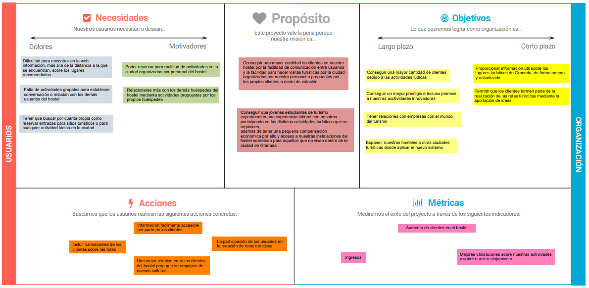
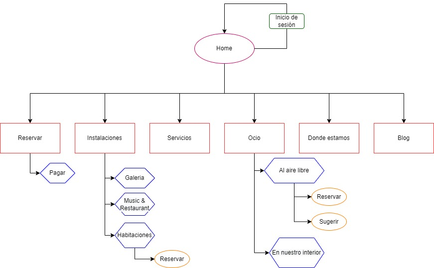

## DIU - Practica2, entregables

## Ideación

Vamos a diseñar una aplicación que mejore las funcionalidades que nos ofrece la página de Carlota Braun.Para ello, hemos pensado en la aplicación Prentix, la cual nos ofrece rutas turísticas por toda la provincia de Granada organizadas por nuestros staff, planes fuera del ámbito turístico como puede ser karting o paintball. Además, tenemos un servicio de propuestas para que los clientes puedan proponer actividades a realizar durante su estancia.

### Malla receptora de información

## Propuesta de valor
Hemos diseñado un scope canvas con nuestros objetivos acerca de la creación de Prentix para aportar una mayor funcionalidad a la página web de Carlota Braun.

## Task analysis

A partir de nuestro scope canvas, hemos identificado los siguientes usuarios
**- Familias:** familias modernas que buscan muchas actividades distintas y relacionarse con más gente
**- Grupos:** viajes de fin de curso, grupos de amigos, etc. Prefieren actividades más activas.
**- Parejas:** planes románticos y conocer el mundo
**- Personas en solitario:** personas que viajan solas buscando nuevas experiencias
**- Hostel:** empresa que ofrece el alojamiento y gestiona las rutas para los clientes
**- Empresas externas:** empresas que proveen las actividades ofreciendo servicios

|                                  | **Familias** | **Grupos** | **Individuos** | **Empresas** | **Parejas** | **Hostel** |
|----------------------------------|--------------|------------|----------------|--------------|-------------|------------|
| **Registrarse**                  | H            | H          | H              | M            | H           |            |
| **Mostrar posibles actividades** | M            | H          | H              |              | H           |            |
| **Reservar actividad**           | M            | H          | H              |              | H           | H          |
| **Sugerir actividades**          | M            | H          | H              | M            | M           |            |
| Consultar horarios               | H            | H          | M              |              | H           |            |
| Modificar perfil                 | L            | L          | L              | L            | L           |            |
| Borrar perfil                    | L            | L          | L              | L            | L           |            |
| Ampliar estancia                 | M            | H          | L              |              | M           |            |
| Valorar las actividades          | H            | H          | M              |              | M           |            |

Las tareas fundamentales están marcadas en negrita.

## Arquitectura de información

### Sitemap

Nuestra propuesta se basa en la web, ya existente, de Carlota Braun a la que le hemos añadido algunas mejoras a la parte de ocio para hacerlo mucho más atractivo

### Labelling

A continuación, explicamos cada uno de los elementos que aparecen en el Site Map:

| Etiqueta              | Descripción                                                                                                                                                                                                                  |
|-----------------------|------------------------------------------------------------------------------------------------------------------------------------------------------------------------------------------------------------------------------|
| Home                  | Es la página principal desde donde podemos acceder a todas las demás secciones de la página web.                                                                |
| Iniciar sesión        | Permite a los clientes se registren o inicien sesión en una cuenta ya registrada para acceder a las distintas actividades y poder obtener. promociones                                                                                                                             |
| Reservar              | Permite reservar al cliente una habitación en una fecha concreta y por una duración determinada.                                                                                                   |
| Instalaciones         | Muestra las distintas zonas del hostel.                                                                                                                                               |
| Servicios | Muestra las distintas facilidades que pone el hostel a disposición de los clientes.                                                                                                                                                                       |
| Ocio  | Este apartado incluye todas las actividades que el hostel pone a disposición de los clientes para hacer más amena la estancia .                                                                                                                     |
| Donde estamos                  | Ubicación del hostel junto con la distancia a los lugares turísticos más importantes. |
| Blog          | Sección sobre artículos turísticos, gastronómicos, etc para aquellos que quieran informarse mucho más sobre lo que ofrece la ciudad.                                                                                                                                            |
| Galería             | Contiene fotografías sobre todas las zonas del hostel, como habitaciones, salas comunes, etc.                                                                                                                                 |
| Music & Restaurant              | Un restaurante propio del hostel donde cada día van distintos grupos de musica a tocar durante unos horarios preestablecidos.                                                                          |
| Habitaciones                | Son alquilables por los clientes, muestran las características de cada una así como su precio.                              |
| Actividades  | Son activididades variadas, ofertadas por el hostel para los residentes.                                                                     |
| Reservar actividad  | Los clientes pueden reservar cualquier actividad al aire libre organizada por el hostel .                                                                     |
| Sugerir actividad  | Los clientes tienen la opción de sugerir posibles nuevas actividades.                                                                     |
| Eventos  | Sección donde se ofrece el horario de los distintos eventos que ocurren dentro del hostel, así como conciertos por ejemplo.                                                                     |

## Prototipo Lo-FI Wireframe

Aquí hemos un boceto visual de como quedarían nuestras extensiones una vez implementadas en la página web de Carlota Braun. Tenemos tanto actividades al aire libre como actividades de interior (dentro del hostel).

## Conclusiones
Para diseñar una aplicación, hay que tener en cuenta las necesidades que nos llevan a realizarlas y las necesidades que puede tener un cliente al usarla. Para tenerlas en cuenta, la mejor opción fue la creación de una serie de personas ficticias, donde cada una fuese distintas de las demas para abarcar el mayor rango posible, y asi trabajar con esas personas para poder hacer un diseño muy flexible.

Las técnicas de Mapa receptora y Scope Canvas nos han ayudado mucho a ver como piensan esta serie de personas, sus necesidades e inquietudes.
Una vez analizada a las personas, también tuvimos en cuenta la simplicidad en el layout que es una característica muy importante que le facilita mucho las cosas a los usuarios.

