# DIU - Practica 3, entregables

## Moodboard (diseño visual + logotipo)   
Hemos creado un Moodboard, con el logo, la ripografía, lapaleta de colores... Todo lo que conforma el Moodboard está explicado en la sección [Guidelines](##Guidelines).

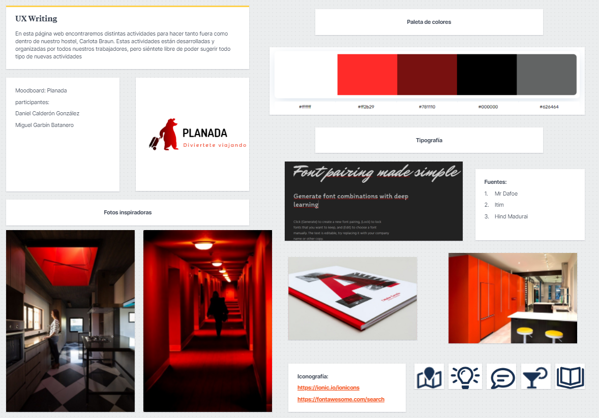

## Landing Page
Para realizar el Landing Page nos hemos ayudadod de la herramienta  [Webflow](www.webflow.io)

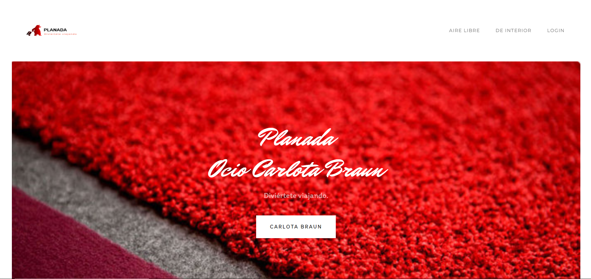
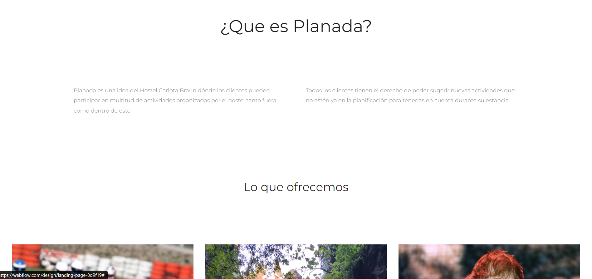
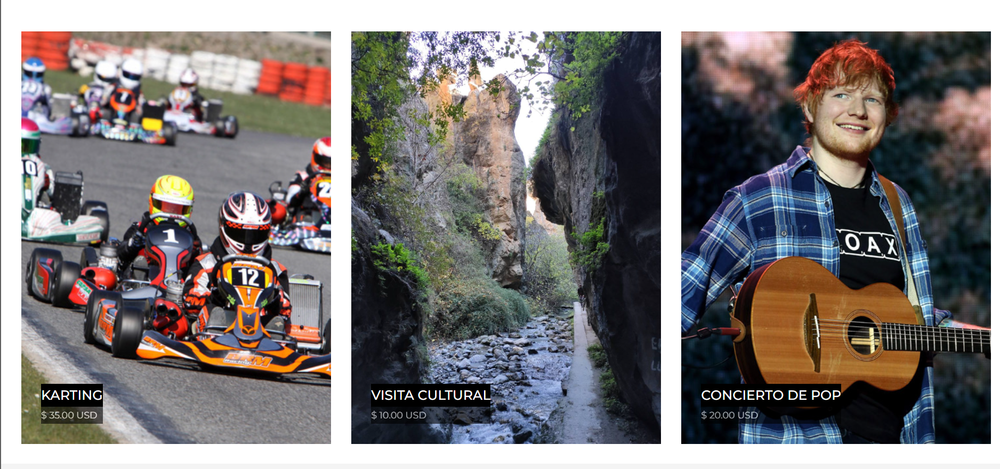
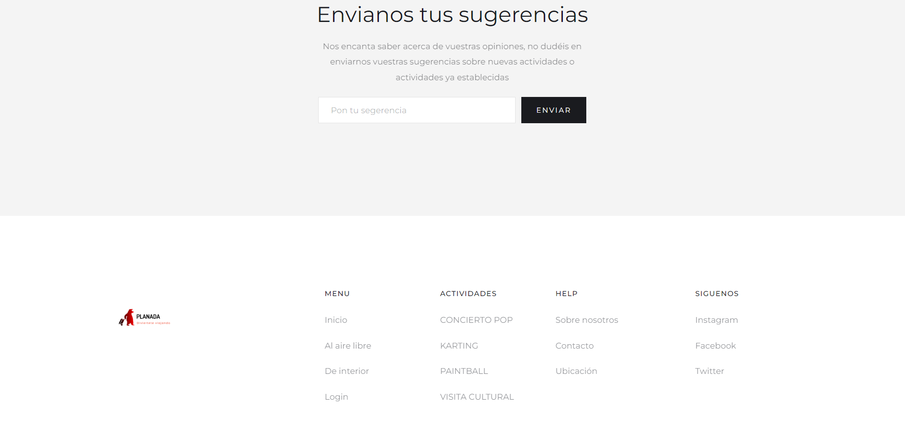

Se puede visitar en el siguiente enlace: [planada_landing_page](https://landing-page-8d9f19.webflow.io/)

## Guidelines
### Logotipo

Para realizar el logo nos hemos ayudado de [Free Logo Maker](https://www.designevo.com/)

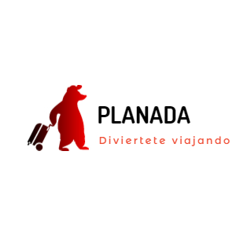

Finalmente usaremos este logo, es el que más se adapta a lo que vamos a realizar en la página, planes por Granada. y además encaja perfectamente con nuestra paleta de colores.

### Paleta de colores
Para la paleta de colores hemos decidido seguir un poco la línea de la página original de carlota braun utilizando los mismos colores o similares, como resultado tenemos la siguiente paleta:

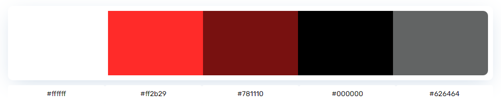

Hemos utilizado la siguiente herramienta: [Color Matcher](https://designs.ai/colors/)

### Iconografía
La iconografía ha sido sacada de la página [Font Awesome](https://fontawesome.com/). Hemos añadido en el moodboard un par de ejemplos que pueden ser usados en la página final.

### Imagenes inspiradoras
Las imágenes inspiradoras han sido obtenidas a partir de los colores utilizados en la paleta con ayuda de la página [Designspiration](https://www.designspiration.com/). Las imagenes inspiradoras se pueden ver en el Moodboard.

### Tipografías
Queríamos usar una tipografía que se asemejara lo máximo a la tipografía utilizada en la página de Carlota Braum, aunque, a su vez, no queríamos que fuese completamente idéntico ya que lo queríamos personalizar mínimamente para que reflejase que no es la propia página de Carlota Braum. Es por eso, que hemos elegido 3 tipos de letra para distintas ocasiones (título, subtítulo, párrafos):

Hemos usado el tipo de letra “Mr Dafoe” para los títulos
Hemos usado el tipo de letra “Itim” para los subtítulos
Hemos usado el tipo de letra “Hind Madurai” para los párrafos de texto

### Patrones
Navigation tabs: Es un patrón de navegación que hemos utilizado para el menú principal en el  encabezado de la página

Fat footer:También se ha incluido un pié de página amplio en donde se añaden datos de interés, enlaces a otras secciones…

Home link: Se ha añadido para que los usuarios puedan regresar a la página de inicio desde otra sección.

## Mockup: LAYOUT HI-FI
Hemos intentado seguir en la medida de lo pisible los patrones diseñados en la páctica anterior
Primero se encuentra la página principal de ocio:

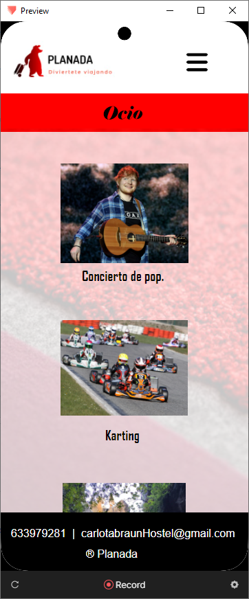

Después tenemos las dos páginas de Actividades en interior y al aire libre:

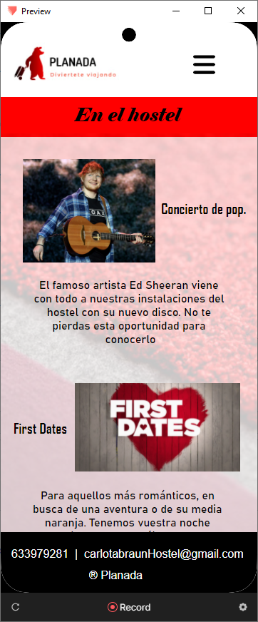
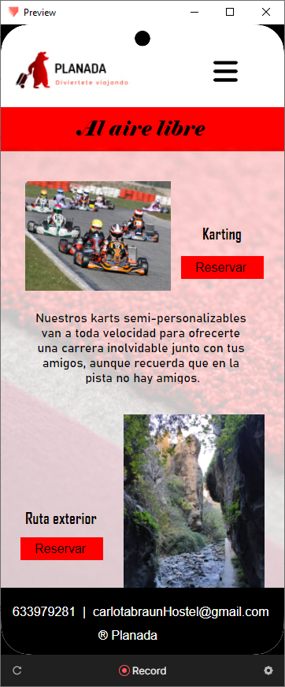

Para havegar por la aplicación hemos implementado también un menú desplegable:

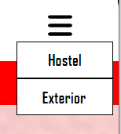

El prototipo se puede ver desde el siguiente enlace https://cloud.protopie.io/p/548b84fcd9 pero algunos widget se deforman dependiendo del dispositivo así que hemos incluido un vídeo.

## Documentación: Publicación del Case Study

Esta practica nos ha parecido quizá la mas larga y completa en cuanto a conteido, pero la hemos ido llevando muy bien y nos ha dado tiempo a realizar todo lo que queríamos. Quizá si hemos encontrado más dificultad a la hora de utilizar protopie ya que no lo conocíamos de antes, pero indagando y viendo tutoriales no ha sido ningún problema.
