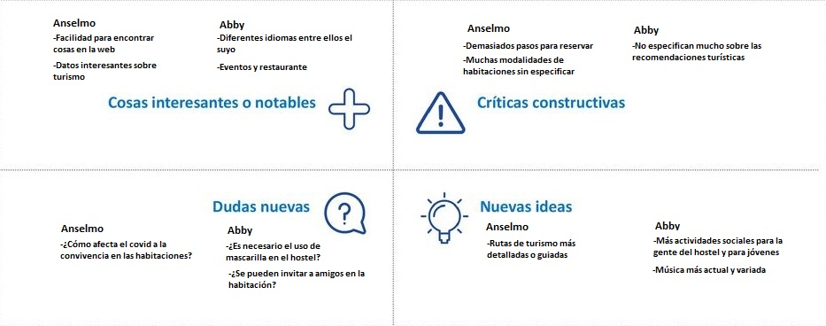
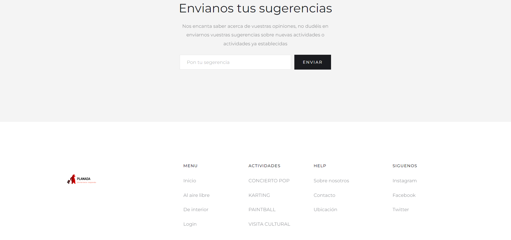
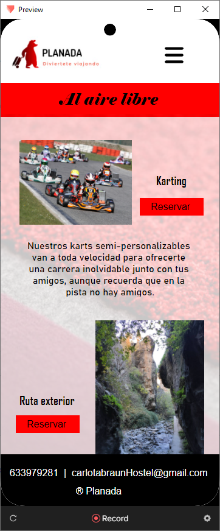

# DIU22
Prácticas Diseño Interfaces de Usuario 2021-22 (Tema: Hostels) 

Grupo: DIU2_Team posits.  Curso: 2021/22 
Updated: 22/5/2022

Proyecto: 
>>> Planada

Descripción: 

>>> Vamos a diseñar una aplicación que mejore las funcionalidades que nos ofrece la página de Carlota Braun.Para ello, hemos pensado en la aplicación Planada, la cual nos ofrece rutas turísticas por toda la provincia de Granada organizadas por nuestros staff, planes fuera del ámbito del ocio como puede ser karting o paintball. Además, tenemos un servicio de propuestas para que los clientes puedan proponer actividades a realizar durante su estancia

Logotipo: 

Miembros
 * :bust_in_silhouette:   Daniel Calderón González     :octocat:     
 * :bust_in_silhouette:  Miguel Garbín Batanero     :octocat:

----- 

# Proceso de Diseño 

## Paso 1. UX Desk Research & Analisis 

 1.a Competitive Analysis
-----

>>> Hemos escogido 6 factores que consideramos importantes para comparar las páginas 
webs. (vamos a valorar del 1 al 5, siendo el 1 el mínimo)

>>> Como conclusión después de haber comparado todas las páginas podemos decir que 
las mejores han sido Broz Hostel y Carlota Braun debido a que tienen las mejores 
puntuaciones en los distintios aspectos estudiados. Aunque como consideramos que el 
idioma puede ser más importante que la fluidez nos decantamos por la página de 
carlota Braun sobre sus competidores. 

 1.b Persona
-----

>>> Hemos creado dos personas que podrían ser usuarios de este hostel aunque uno tiene un perfil más alejado de este tipo de hostels y el otro más afín.

>>> La primera persona es [Anselmo](./P1/AnselmoP.PNG), un chico de campo de 35 años que quiere salir un poco de allí y visitar la ciudad con su novia.

>>> La segunda es [Abby](./P1/AbbyP.PNG), una chica de 21 años con ganas de conocer españa para su futuro erasmus, aunque sus padres no estén mucho por la labor.

>>> Ambos personas son muy interesantes. Presentan perfiles totalmente distintos para un posible uso de la aplicación.

 1.c User Journey Map
----

>>> Planteamos dos experiencias distintas para Anselmo y Abby:

>>> [Anselmo](./P1/AnselmoJM.PNG) Encuentra algunos problemas ya que no está mu acostumbrado a las tecnologías. Finalmente puede reservar sin problemas y tiene una buena experiencia.

>>> [Abby](./P1/AbbyJM.PNG) Sus padres no le ayudan mucho por eso tuvo que hacer toda la reserva ella sola. Al final sus padres disfrutaron de españa y cambiaron de opinión.

 1.d Usability Review
----
>>>  El documento se encuentra en [Usability-review-template.pdf](./P1/Usability-review-template.pdf).

>>>  En general, la página web de Carlota Braun cumple con todos los requisitos necesarios 
para una página de un hostel.
Como factores a destacar podemos encontrar que tiene diversos idiomas para 
traducirla. También todas las cosas importantes están muy visibles como las reservas, 
los puntos de interés cercanos al hostel y las fotos de las habitaciones.
Podemos encontrar ayudas como el número de teléfono o el correo para hacer 
consultas, así como la ubicación del hostel y como llegar desde diferentes puntos como 
el aeropuerto, etc.
Sin embargo, también hemos encontrado algunos aspectos negativos, el más 
destacable es la lentitud de carga en algunos enlaces como podría ser “MUSIC BAR & 
RESTAURANT”. Otros fallos menores serían la foto de inicio y el botón que parpadea, 
sobre cargando un poco la visión del cliente.
Como conclusión nuestra puntuación para la web de este hostel es bastante alta, con 
unas pequeñas modificaciones podría mejorar bastante y llegar a ser casi perfecta.

## Paso 2. UX Design  

 2.a Feedback Capture Grid / EMpathy map / POV
----

>>> Vamos a diseñar una aplicación que mejore las funcionalidades que nos ofrece la página de Carlota Braun.Para ello, hemos pensado en la aplicación Planada, la cual nos ofrece rutas turísticas por toda la provincia de Granada organizadas por nuestros staff, planes fuera del ámbito turístico como puede ser karting o paintball. Además, tenemos un servicio de propuestas para que los clientes puedan proponer actividades a realizar durante su estancia.

 2.b ScopeCanvas
----
>>> Hemos diseñado un scope canvas con nuestros objetivos acerca de la creación de Prentix para aportar una mayor funcionalidad a la página web de Carlota Braun.

 2.b Tasks analysis 
-----

>>> A partir de nuestro scope canvas, hemos identificado los siguientes usuarios
**- Familias:** familias modernas que buscan muchas actividades distintas y relacionarse con más gente
**- Grupos:** viajes de fin de curso, grupos de amigos, etc. Prefieren actividades más activas.
**- Parejas:** planes románticos y conocer el mundo
**- Personas en solitario:** personas que viajan solas buscando nuevas experiencias
**- Hostel:** empresa que ofrece el alojamiento y gestiona las rutas para los clientes
**- Empresas externas:** empresas que proveen las actividades ofreciendo servicios

|                                  | **Familias** | **Grupos** | **Individuos** | **Empresas** | **Parejas** | **Hostel** |
|----------------------------------|--------------|------------|----------------|--------------|-------------|------------|
| **Registrarse**                  | H            | H          | H              | M            | H           |            |
| **Mostrar posibles actividades** | M            | H          | H              |              | H           |            |
| **Reservar actividad**           | M            | H          | H              |              | H           | H          |
| **Sugerir actividades**          | M            | H          | H              | M            | M           |            |
| Consultar horarios               | H            | H          | M              |              | H           |            |
| Modificar perfil                 | L            | L          | L              | L            | L           |            |
| Borrar perfil                    | L            | L          | L              | L            | L           |            |
| Ampliar estancia                 | M            | H          | L              |              | M           |            |
| Valorar las actividades          | H            | H          | M              |              | M           |            |

Las tareas fundamentales están marcadas en negrita.

 2.c IA: Sitemap + Labelling 
----

>>> ### Sitemap

Nuestra propuesta se basa en la web, ya existente, de Carlota Braun a la que le hemos añadido algunas mejoras a la parte de ocio para hacerlo mucho más atractivo

>>> ### Labelling

A continuación, explicamos cada uno de los elementos que aparecen en el Site Map:

| Etiqueta              | Descripción                                                                                                                                                                                                                  |
|-----------------------|------------------------------------------------------------------------------------------------------------------------------------------------------------------------------------------------------------------------------|
| Home                  | Es la página principal desde donde podemos acceder a todas las demás secciones de la página web.                                                                |
| Iniciar sesión        | Permite a los clientes se registren o inicien sesión en una cuenta ya registrada para acceder a las distintas actividades y poder obtener. promociones                                                                                                                             |
| Reservar              | Permite reservar al cliente una habitación en una fecha concreta y por una duración determinada.                                                                                                   |
| Instalaciones         | Muestra las distintas zonas del hostel.                                                                                                                                               |
| Servicios | Muestra las distintas facilidades que pone el hostel a disposición de los clientes.                                                                                                                                                                       |
| Ocio  | Este apartado incluye todas las actividades que el hostel pone a disposición de los clientes para hacer más amena la estancia .                                                                                                                     |
| Donde estamos                  | Ubicación del hostel junto con la distancia a los lugares turísticos más importantes. |
| Blog          | Sección sobre artículos turísticos, gastronómicos, etc para aquellos que quieran informarse mucho más sobre lo que ofrece la ciudad.                                                                                                                                            |
| Galería             | Contiene fotografías sobre todas las zonas del hostel, como habitaciones, salas comunes, etc.                                                                                                                                 |
| Music & Restaurant              | Un restaurante propio del hostel donde cada día van distintos grupos de musica a tocar durante unos horarios preestablecidos.                                                                          |
| Habitaciones                | Son alquilables por los clientes, muestran las características de cada una así como su precio.                              |
| Actividades  | Son activididades variadas, ofertadas por el hostel para los residentes.                                                                     |
| Reservar actividad  | Los clientes pueden reservar cualquier actividad al aire libre organizada por el hostel .                                                                     |
| Sugerir actividad  | Los clientes tienen la opción de sugerir posibles nuevas actividades.                                                                     |
| Eventos  | Sección donde se ofrece el horario de los distintos eventos que ocurren dentro del hostel, así como conciertos por ejemplo.                                                                     |

 2.d Wireframes
-----

>>> Aquí hemos un boceto visual de como quedarían nuestras extensiones una vez implementadas en la página web de Carlota Braun. Tenemos tanto actividades al aire libre como actividades de interior (dentro del hostel).

## Conclusiones
>>> Para diseñar una aplicación, hay que tener en cuenta las necesidades que nos llevan a realizarlas y las necesidades que puede tener un cliente al usarla. Para tenerlas en cuenta, la mejor opción fue la creación de una serie de personas ficticias, donde cada una fuese distintas de las demas para abarcar el mayor rango posible, y asi trabajar con esas personas para poder hacer un diseño muy flexible.

>>> Las técnicas de Mapa receptora y Scope Canvas nos han ayudado mucho a ver como piensan esta serie de personas, sus necesidades e inquietudes.
Una vez analizada a las personas, también tuvimos en cuenta la simplicidad en el layout que es una característica muy importante que le facilita mucho las cosas a los usuarios.

## Paso 3. Mi UX-Case Study (diseño)

 3.a Moodboard
-----

>>> Hemos creado un Moodboard, con el logo, la ripografía, lapaleta de colores... Todo lo que conforma el Moodboard está explicado en la sección [Guidelines](##Guidelines).

  3.b Landing Page
----

>>> Para realizar el Landing Page nos hemos ayudadod de la herramienta  [Webflow](www.webflow.io)

>>> Se puede visitar en el siguiente enlace: [planada_landing_page](https://landing-page-8d9f19.webflow.io/)

 3.c Guidelines
----

### Logotipo

>>> Para realizar el logo nos hemos ayudado de [Free Logo Maker](https://www.designevo.com/)

>>> Finalmente usaremos este logo, es el que más se adapta a lo que vamos a realizar en la página, planes por Granada. y además encaja perfectamente con nuestra paleta de colores.

### Paleta de colores
>>> Para la paleta de colores hemos decidido seguir un poco la línea de la página original de carlota braun utilizando los mismos colores o similares, como resultado tenemos la siguiente paleta:

>>> Hemos utilizado la siguiente herramienta: [Color Matcher](https://designs.ai/colors/)

### Iconografía
>>> La iconografía ha sido sacada de la página [Font Awesome](https://fontawesome.com/). Hemos añadido en el moodboard un par de ejemplos que pueden ser usados en la página final.

### Imagenes inspiradoras
>>> Las imágenes inspiradoras han sido obtenidas a partir de los colores utilizados en la paleta con ayuda de la página [Designspiration](https://www.designspiration.com/). Las imagenes inspiradoras se pueden ver en el Moodboard.

### Tipografías
>>> Queríamos usar una tipografía que se asemejara lo máximo a la tipografía utilizada en la página de Carlota Braum, aunque, a su vez, no queríamos que fuese completamente idéntico ya que lo queríamos personalizar mínimamente para que reflejase que no es la propia página de Carlota Braum. Es por eso, que hemos elegido 3 tipos de letra para distintas ocasiones (título, subtítulo, párrafos):

>>> Hemos usado el tipo de letra “Mr Dafoe” para los títulos
>>> Hemos usado el tipo de letra “Itim” para los subtítulos
>>> Hemos usado el tipo de letra “Hind Madurai” para los párrafos de texto

### Patrones
>>> Navigation tabs: Es un patrón de navegación que hemos utilizado para el menú principal en el  encabezado de la página

>>> Fat footer:También se ha incluido un pié de página amplio en donde se añaden datos de interés, enlaces a otras secciones…

>>> Home link: Se ha añadido para que los usuarios puedan regresar a la página de inicio desde otra sección.

  3.d Mockup
----

>>> Hemos intentado seguir en la medida de lo pisible los patrones diseñados en la páctica anterior
Primero se encuentra la página principal de ocio:

>>> Después tenemos las dos páginas de Actividades en interior y al aire libre:

>>> Para havegar por la aplicación hemos implementado también un menú desplegable:

 3.e ¿My UX-Case Study?
-----

>>> Esta practica nos ha parecido quizá la mas larga y completa en cuanto a conteido, pero la hemos ido llevando muy bien y nos ha dado tiempo a realizar todo lo que queríamos. Quizá si hemos encontrado más dificultad a la hora de utilizar protopie ya que no lo conocíamos de antes, pero indagando y viendo tutoriales no ha sido ningún problema.

## Paso 4. Evaluación 

 4.a Caso asignado
----

>>> Breve descripción del caso asignado con enlace a  su repositorio Github

 4.b User Testing
----

>>> Seleccione 4 personas ficticias. Exprese las ideas de posibles situaciones conflictivas de esa persona en las propuestas evaluadas. Asigne dos a Caso A y 2 al caso B
 

| Usuarios | Sexo/Edad     | Ocupación   |  Exp.TIC    | Personalidad | Plataforma | TestA/B
| ------------- | -------- | ----------- | ----------- | -----------  | ---------- | ----
| User1's name  | H / 18   | Estudiante  | Media       | Introvertido | Web.       | A 
| User2's name  | H / 18   | Estudiante  | Media       | Timido       | Web        | A 
| User3's name  | M / 35   | Abogado     | Baja        | Emocional    | móvil      | B 
| User4's name  | H / 18   | Estudiante  | Media       | Racional     | Web        | B 

. 4.c Cuestionario SUS
----

>>> Usaremos el **Cuestionario SUS** para valorar la satisfacción de cada usuario con el diseño (A/B) realizado. Para ello usamos la [hoja de cálculo](https://github.com/mgea/DIU19/blob/master/Cuestionario%20SUS%20DIU.xlsx) para calcular resultados sigiendo las pautas para usar la escala SUS e interpretar los resultados
http://usabilitygeek.com/how-to-use-the-system-usability-scale-sus-to-evaluate-the-usability-of-your-website/)
Para más información, consultar aquí sobre la [metodología SUS](https://cui.unige.ch/isi/icle-wiki/_media/ipm:test-suschapt.pdf)

>>> Adjuntar captura de imagen con los resultados + Valoración personal 

 4.d Usability Report
----

>> Añadir report de usabilidad para práctica B (la de los compañeros)

>>> Valoración personal 

>>> ## Paso 5. Evaluación de Accesibilidad  (no necesaria)

>>>   5.a Accesibility evaluation Report 
>>>> ----

>>> Indica qué pretendes evaluar (de accesibilidad) sobre qué APP y qué resultados has obtenido 

>>> 5.a) Evaluación de la Accesibilidad (con simuladores o verificación de WACG) 
>>> 5.b) Uso de simuladores de accesibilidad 

>>> (uso de tabla de datos, indicar herramientas usadas) 

>>> 5.c Breve resumen del estudio de accesibilidad (de práctica 1) y puntos fuertes y de mejora de los criterios de accesibilidad de tu diseño propuesto en Práctica 4.

## Conclusión final / Valoración de las prácticas

>>> (90-150 palabras) Opinión del proceso de desarrollo de diseño siguiendo metodología UX y valoración (positiva /negativa) de los resultados obtenidos  

